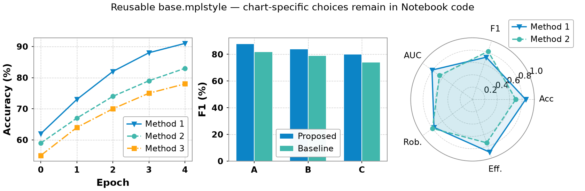
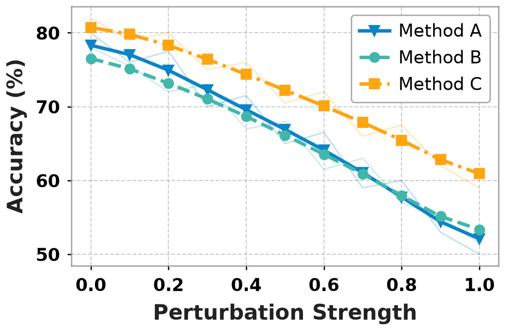
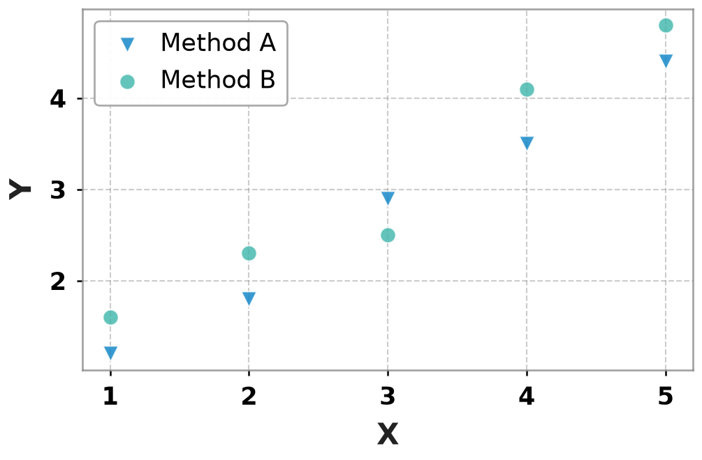
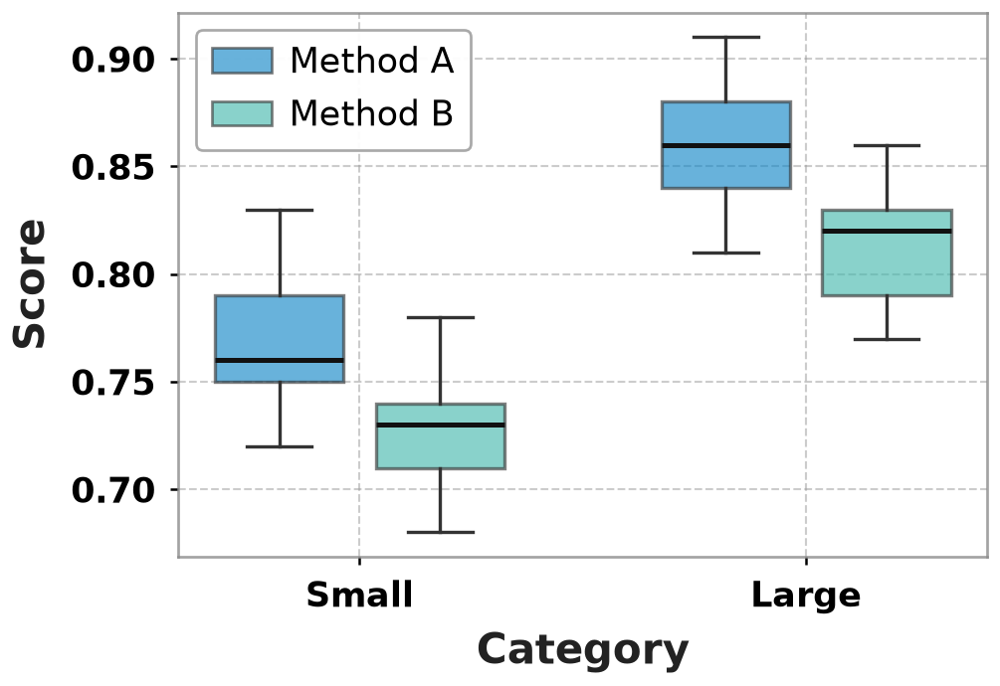
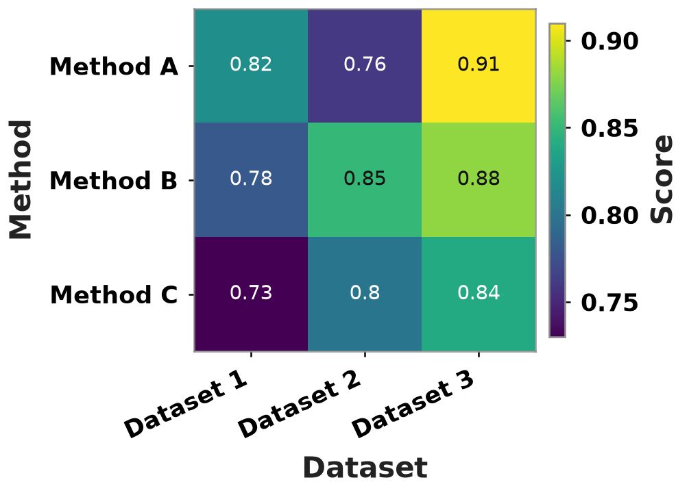
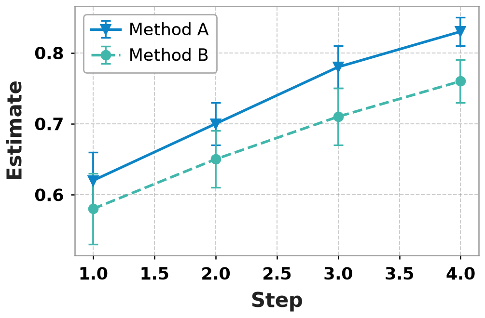
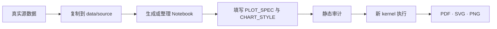

# Draw Figure Like a Human

写给课题组学生的常用实验结果图的可复现绘图 SKILL。
我们以 Jupyter Notebook 作为可编辑源码，用真实数据生成论文级折线图、高斯平滑折线图、柱状图、雷达图、散点图、箱线图、热图和误差棒图，并同时导出 PDF、SVG 与高分辨率 PNG 等图像。
所有论文必须以 PDF 格式的图像为主，其他格式放大后极易失真。

本工作区的技能在：

- [`draw-figure-like-a-human`](./skills/draw-figure-like-a-human/SKILL.md)：绘制、修改
  科研数据图，或把现有 Matplotlib 脚本和 Notebook 整理为可复用模板；



> 上图使用固定测试数据，只用于展示折线、marker、柱形、图例、网格和雷达图等视觉
> 能力，不代表任何真实实验结论。真实任务只使用用户提供的数据。

| **高斯平滑折线图**| **散点图** | **箱线图** | **热图** | **误差棒图** |
| :---: | :---: | :---: | :---: | :---: |
|  |  |  |  |  |

配色分为两类：折线图、高斯平滑折线图、柱状图、雷达图、散点图、箱线图和误差棒图使用同一套六色分类循环。跨图保持同一系列身份时，应显式复用稳定的系列标签映射，不能只依赖数据行的出现顺序。热图使用连续 `viridis` 色标，颜色编码数值大小，不编码 Method A、Method B 等系列身份。

## 能做什么

- 从 CSV、TSV、Excel 或 JSON 中读取真实实验结果；
- 根据完整数值表创建 8 种独立科研数据图；
- 把已有 `.py` 或 `.ipynb` 绘图代码整理成自包含 Notebook 模板；
- 将数据语义、数据变换和视觉样式分开，避免改样式时意外改变实验含义；
- 使用颜色、marker、线型或 hatch 做冗余编码，提高灰度和色觉差异下的可辨性；
- 所有笛卡尔坐标模板默认沿用折线图和柱状图的完整四边框、虚线网格、粗体轴标签与
  带边框图例，不使用隐藏上边框和右边框的半开放样式；
- 从新 kernel 执行全部单元，并输出可编辑的 PDF、SVG 和至少 300 PPI 的 PNG。

这个技能不用于方法框图、模型架构图、流程图或装饰性插画。只有论文截图、PDF、PNG
或 JPEG 而没有原始数据和代码时，请先参考[图像转绘图代码](#只有-pdfpng-或-jpeg-科研图时)
一节。

## 八种独立图表模板

| 模板 | 适合场景 | 关键约束 |
| --- | --- | --- |
| `line_chart.ipynb` | 学习曲线、连续横轴趋势、多方法对比、误差带 | 系列颜色、marker 和线型保持一一对应 |
| `gaussian_smoothed_line_chart.ipynb` | 等距横轴上的噪声趋势展示、平滑后多方法对比 | 明确 `sigma` 和边界模式；保留原始淡线；不得覆盖端点 |
| `bar_chart.ipynb` | 离散类别比较、消融实验、分组或堆叠结果 | 默认从零开始；重复类别必须先明确聚合 |
| `radar_chart.ipynb` | 多个同向指标的整体轮廓比较 | 明确归一化方法，并让所有系列共用径向范围 |
| `scatter_chart.ipynb` | 两个连续变量的关系、分组观测、离群点检查 | 不默认拟合回归线，也不暗示相关或因果关系 |
| `box_chart.ipynb` | 多组分布、中位数、四分位距与异常值 | 使用原始观测；默认保留异常值，不把箱体当作误差区间 |
| `heatmap_chart.ipynb` | 方法 × 数据集矩阵、相关矩阵、参数网格 | 重复单元必须先显式聚合；色标范围属于科学语义 |
| `errorbar_chart.ipynb` | 均值或估计量及 SD、SE、CI 等不确定性 | 必须声明误差含义；支持对称误差或显式上下界 |

当前每种图都是一个完整、独立的 Notebook 文件，没有用 `mode` 参数把不同图形融合到
同一模板。以后是否抽取共享组件，应在模板稳定后再评估，不以牺牲可读性为前提。

如果精确比较比整体轮廓更重要，优先使用散点图、柱状图或表格，而不是雷达图。

## 工作流



源数据保持不可变。聚合、归一化、排序、平滑和误差计算只存在于 Notebook 内存，
并记录在 `FIGURE_METADATA` 中；样式修改不得暗中改变数据、系列顺序或坐标轴语义。

## 给 Agent 的请求示例

直接把数据文件和目标告诉 Agent 即可，例如：

```text
请使用 draw-figure-like-a-human，根据 results.csv 绘制训练轮次与准确率的多方法折线图。
保留均值和标准差，输出可编辑 Notebook、PDF、SVG 和 300 PPI PNG。
```

```text
请把 experiments/plot_ablation.py 整理成可复用的柱状图 Notebook 模板。
保留真实聚合逻辑，移除绝对路径和论文专属名称，不要编造示例数据。
```

```text
请检查这个绘图项目的图例映射、灰度可辨性和最终单栏尺寸，只修改视觉样式，
不要改变数据、坐标范围或统计方法。
```

## 手动使用模板

运行脚本的 Python 环境需要安装 Jupyter、Matplotlib、pandas、NumPy、SciPy、`nbformat`
和 `nbclient`；读取 Excel 还需要 `openpyxl` 等对应引擎。

先创建工作区并复制源数据：

```bash
python3 <skill-root>/scripts/resolve_io.py /path/to/paper \
  --paper-name "Paper Name" \
  --source results.csv \
  --create
```

再根据最接近的模板创建 Notebook：

```bash
python3 <skill-root>/scripts/create_notebook.py /path/to/figs/paper-name \
  --paper-name "Paper Name" \
  --figure-name "fig-01-results" \
  --chart-type line \
  --source-file results.csv \
  --x-column epoch \
  --y-column accuracy \
  --series-column method \
  --x-label "Epoch" \
  --y-label "Accuracy (%)" \
  --claim "The proposed method converges faster."
```

不同模板使用独立的数据语义参数：

- 高斯平滑折线图使用 `--chart-type gaussian-line`，并可用
  `--smoothing-sigma` 指定以样本间隔为单位的高斯 `sigma`；
- 箱线图使用 `--x-column` 指定类别列、`--y-column` 指定数值列；
- 热图使用 `--x-column`、`--y-column` 和 `--value-column`，可增加
  `--colorbar-label`；
- 误差棒图使用 `--error-column` 表示对称误差，或同时使用 `--lower-column` 和
  `--upper-column` 表示上下界。

完成数据变换和样式调整后，先审计，再从新 kernel 执行：

```bash
python3 <skill-root>/scripts/charts/audit_notebook.py \
  /path/to/figs/paper-name/notebooks/fig-01-results.ipynb

python3 <skill-root>/scripts/charts/execute_notebook.py \
  /path/to/figs/paper-name/notebooks/fig-01-results.ipynb
```

更完整的说明见：

- [使用 Notebook 模板](./skills/draw-figure-like-a-human/references/using-templates.md)
- [将现有代码转为模板](./skills/draw-figure-like-a-human/references/building-templates.md)

## Notebook 的四个修改入口

| 入口 | 负责内容 |
| --- | --- |
| `FIGURE_METADATA` | 图名、论文名、结论、数据来源、变换、不确定性和输出记录 |
| `SOURCE_FILE` | `data/source/` 中的不可变真实数据文件 |
| `PLOT_SPEC` | 列名、轴标签、系列字段等数据语义 |
| `CHART_STYLE` | `canvas`、`marks`、`legend`、`axes` 四层视觉配置 |

全局通用的 Matplotlib 参数来自
[`base.mplstyle`](./skills/draw-figure-like-a-human/assets/styles/base.mplstyle)，并嵌入每个
Notebook；画布尺寸、柱宽、坐标范围、图例位置等单图选择仍留在 `CHART_STYLE`。
这样复制出去的 Notebook 不依赖 Skill 安装路径，也能独立重跑。

## 配色辅助

`recommend-color-palette` 是低频的配色配置技能。它可以为指定系列生成稳定的颜色映射、
来源记录和可视化预览，再把 `catalog.json` 交给绘图 Notebook 使用。


> 配色预览展示颜色与系列身份的固定映射。最终仍需在论文实际尺寸、灰度和目标图表中
> 检查，不能只根据色块预览判断可读性。

## 输出目录

默认工作区结构如下：

```text
{project_root}/figs/{paper_slug}/
├── data/
│   └── source/          # CSV、Excel、JSON 等不可变输入
├── notebooks/           # 可编辑、可重跑的 .ipynb
└── figures/             # PDF、SVG、PNG
```

运行时文件、测试数据、预览和打包产物不得写入 `skills/`。仓库中的：

- [`test`](./test/) 保存测试、评测提示词、夹具和示例请求；
- [`workspace`](./workspace/) 保存运行时预览、中间文件、审阅页面和打包结果；
- [`assets`](./assets/) 只保存 README 使用的稳定示例图。

## 输出质量

- 优先使用 PDF 和 SVG 作为论文插图；它们是矢量输出，不使用 PPI 衡量清晰度；
- PNG 在论文最终排版尺寸下至少达到 300 PPI。Matplotlib 使用参数名 `dpi`，模板设置
  `savefig.dpi: 300`，审计脚本会拒绝低于 300 的显式值；
- `figure.dpi: 100` 只控制 Notebook 内的交互预览，不影响最终导出；
- 如果期刊或出版社要求 600 PPI 等更高分辨率，按更高要求导出；
- 不使用 `bbox_inches="tight"` 暗中改变最终画布尺寸；
- 在论文实际栏宽检查裁切、文字碰撞、图例对应关系、灰度和色觉差异下的可辨性。

## 只有 PDF、PNG 或 JPEG 科研图时

`draw-figure-like-a-human` 不直接从 PDF 或位图参考图中推断可复用 `.mplstyle`，也不能
从论文文字可靠恢复缺失的实验数值。没有原始绘图代码时，可以把以下 chart-to-code
项目作为上游重建工具或实现参考：

- [ChartMimic](https://github.com/ChartMimic/ChartMimic)：把科研图表重建为可执行绘图
  代码，并提供直接模仿和定制模仿评测；
- [Plot2Code](https://github.com/TencentARC/Plot2Code)：提供科研数据图的图像转代码
  流程和评测工具；
- [Chart2Code](https://github.com/CSU-JPG/Chart2Code)：覆盖分层 chart-to-code 任务，
  包括根据参考图重建绘图代码；
- [ChartCoder](https://github.com/thunlp/ChartCoder)：提供开源 chart-to-code 模型和
  推理实现；
- [NaturePanelForge](https://github.com/littlepeachs/NaturePanelForge)：展示从论文、
  子图拆分到绘图代码重建，并通过反复渲染比较修正结果的工作流。

这些仓库不是本工作区的依赖。它们生成的代码只能视为待核验候选：确认数据、数据变换、
标签和视觉参数后，再使用 `draw-figure-like-a-human` 整理成可复用 Notebook 模板。

## 功能边界

- `draw-figure-like-a-human` 只处理实验结果类数据图，不处理方法框图、架构图和插画；
- 不根据论文结论编造缺失数据，不用随机数补齐真实实验；
- 不静默删除缺失值，也不把重复观测自动视为独立实验；
- 不把坐标范围、平滑、归一化或筛选误当成纯视觉样式；
- 只有用户明确要求时，才把多个示例的共同视觉特征提升到全局 `base.mplstyle`。
